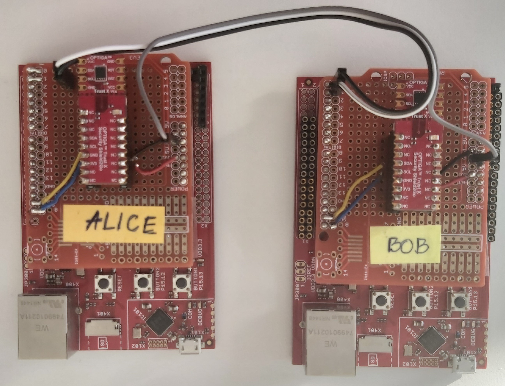
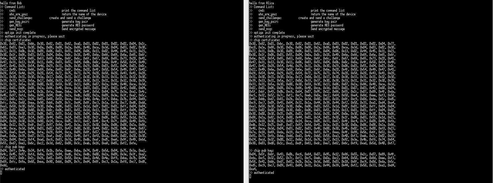
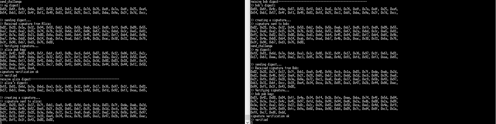
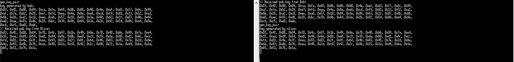
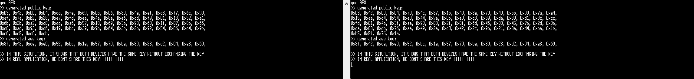
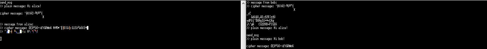

# Motivation

This application demonstrate tipical use cases of secure element in embedded hardware security. These use cases consists of:

* Device Identification 

* Devices Authentication 

* Key generation for encrypted communication 

* Encrypted communication 

The use cases are demonstrated based on Optiga trust X secure element and XMC4800 microcontroller from Infineon

# Requirements 

## Software

* DAVE IDE: building application
* Console terminal program (TeraTerm is used)

## Hardware

* XMC4800 evaluation boards
* Optiga Trust X secure element
* Jumper wires, bread board and USB cables

# How to build the application

* Import the project to DAVE IDE
* Compile, and flash the code to both XMC4800 boards

# How to run the application

1. Connect two boards via serial port

2. Start terminal with the following parameters:
  
    * Baudrate: 115200
    * Data: 8
    * Stop: 1
    * Parity: none 
3. Hit reset on two boards, the information on the terminal shows the authentication process between the XMC and the Optiga. The process makes sure the application is executed on a genuine hardware. 

4. Type command "send_challenge" to let these 2 boards authenticate to each others

5. type command "gen_key_pair" to issue a public/private key pair generation on the two boards

6. Type command "gen_AES" to derive the AES key using ECCDH operation. Notice that, the key of both boards are the same although they never share this information with eacho other.

7. Type "send_msg" to send secret message between the boards

# Change Log

## Version 1.0.0

* Initialize version 

# Contact

Quang Hai Nguyen

Field Application Engineer

Arrow Central Europe GmbH

qnguyen@arroweurope.com

